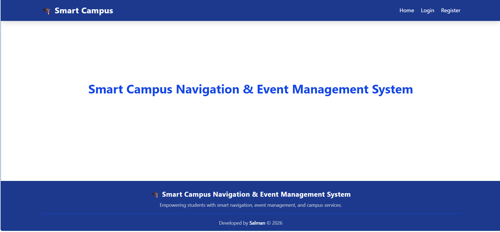
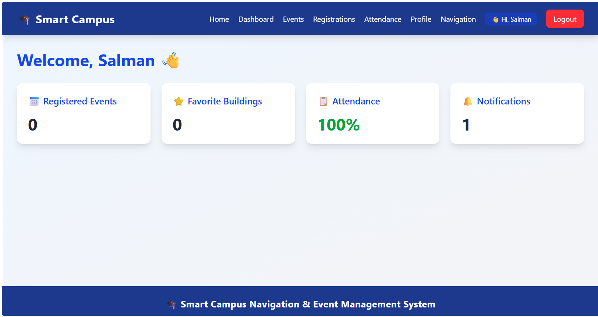
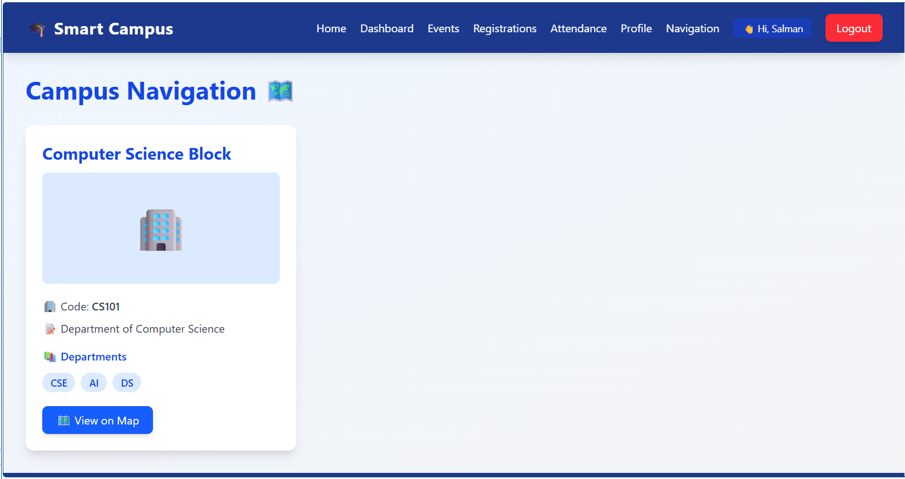
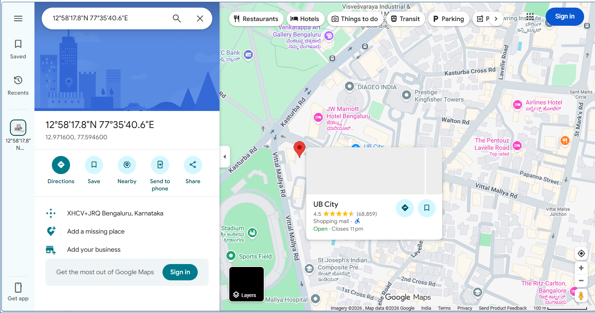
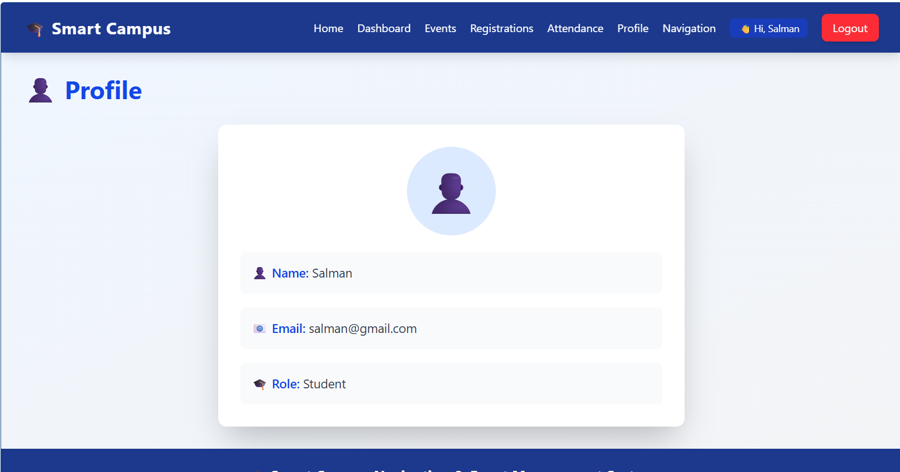
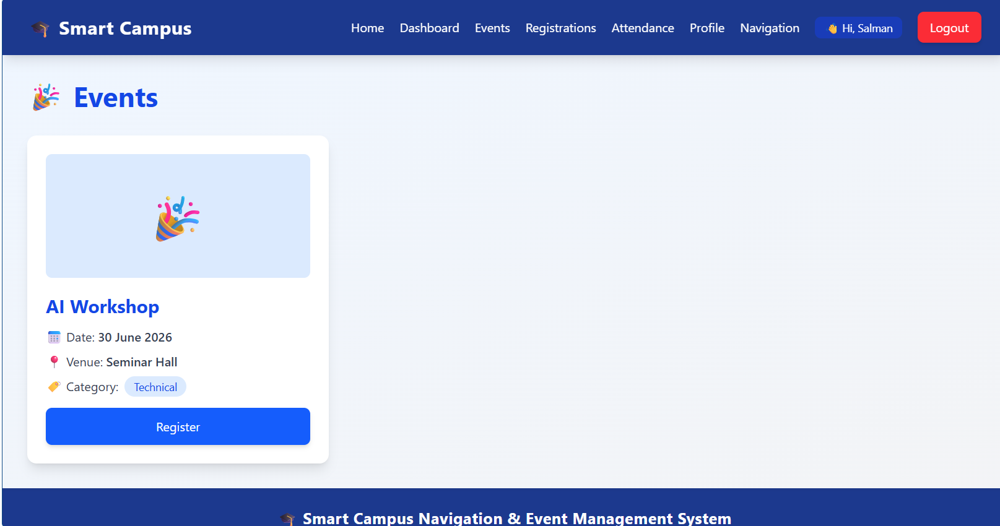
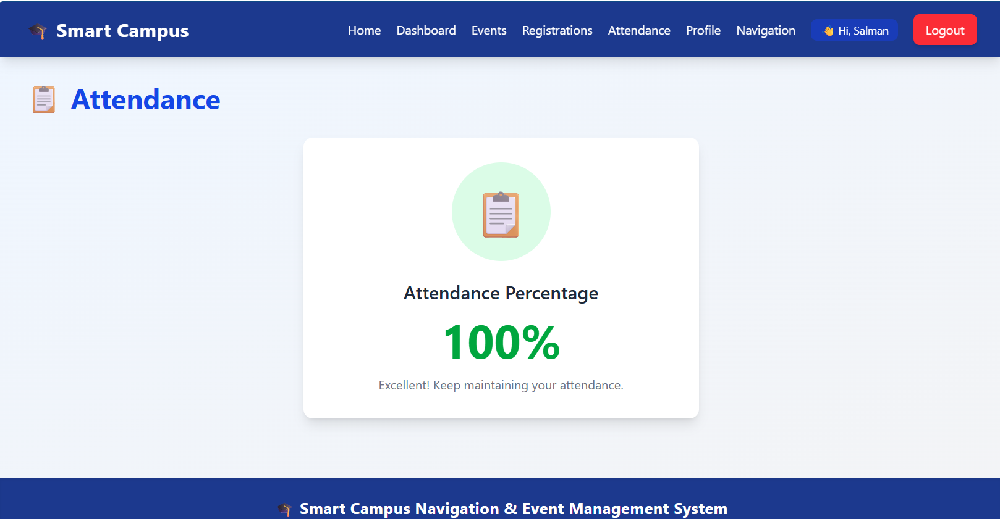
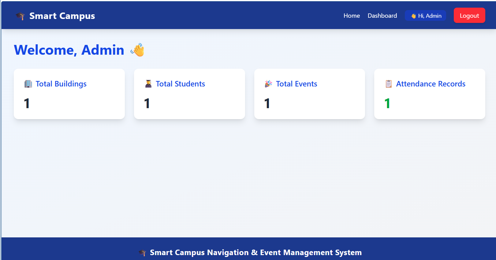

# 🎓 Smart Campus Navigation & Event Management System

A full-stack MERN application that helps students navigate their campus, register for events, track attendance, receive notifications, and manage their profiles. The system also provides an admin panel for managing buildings, events, attendance records, and notifications.

---

## 📌 Project Overview

The Smart Campus Navigation & Event Management System simplifies campus activities by combining:

- 🗺️ Campus Navigation using Google Maps
- 🎉 Event Registration and Management
- 📋 Attendance Tracking
- 🔔 Notifications System
- 👤 Student Profile Management
- 🏢 Building and Department Information
- 🔐 Role-Based Authentication (Student & Admin)

---

# 🚀 Features

## 👨‍🎓 Student Features

- 🔐 Student Registration & Login
- 🗺️ Campus Navigation with Google Maps
- 🎉 Event Registration and Management
- 📋 Attendance Tracking
- 🔔 Notifications
- 👤 Profile Management

## 👨‍💼 Admin Features

- 🔐 Admin Authentication
- 🏢 Building Management
- 🎉 Event Management
- 📋 Attendance Management
- 🔔 Notification Management
- 📊 Dashboard Analytics

---

# 🛠️ Tech Stack

### Frontend
- React.js
- Vite
- React Router DOM
- Context API
- Axios
- Tailwind CSS

### Backend
- Node.js
- Express.js
- JWT Authentication
- REST API

### Database
- MongoDB
- Mongoose

### Third-Party Services
- Google Maps API

### Version Control
- Git
- GitHub

---

# 📂 Project Structure

```bash
Smart-Campus-Navigation-Event-Management
│
├── client
├── server
├── docs
├── .gitignore
└── README.md
```

---

# 🖼️ Screenshots

## 🏠 Home Page


## 📊 Student Dashboard


## 🗺️ Campus Navigation


## 🌍 Google Maps Integration


## 👤 Student Profile


## 🎉 Events


## 📋 Attendance


## 👨‍💼 Admin Dashboard


---

# ⚙️ Installation

## Clone Repository

```bash
git clone https://github.com/MohammedSalman7/Smart-Campus-Navigation-Event-Management.git
```

## Frontend Setup

```bash
cd client
npm install
npm run dev
```

Frontend runs on:

```bash
http://localhost:5173
```

## Backend Setup

```bash
cd server
npm install
npm run dev
```

Backend runs on:

```bash
http://localhost:5000
```

---

# 🔑 Environment Variables

Create:

```bash
server/.env
```

Add:

```env
PORT=5000
MONGO_URI=YourMongoDBConnectionString
JWT_SECRET=YourSecretKey
```

---

# 🌐 Live Demo

**Frontend:** Coming Soon

**Backend API:** Coming Soon

*(Update these links after deployment on Vercel and Render.)*

---

# 🚀 Future Enhancements

- QR-Based Attendance System
- AI Chatbot for Campus Assistance
- Real-Time Notifications
- Email Notifications
- Mobile Application

---

# 👨‍💻 Author

**Mohammed Salman**

GitHub:
https://github.com/MohammedSalman7

---

# ⭐ If you like this project, please give it a star on GitHub!